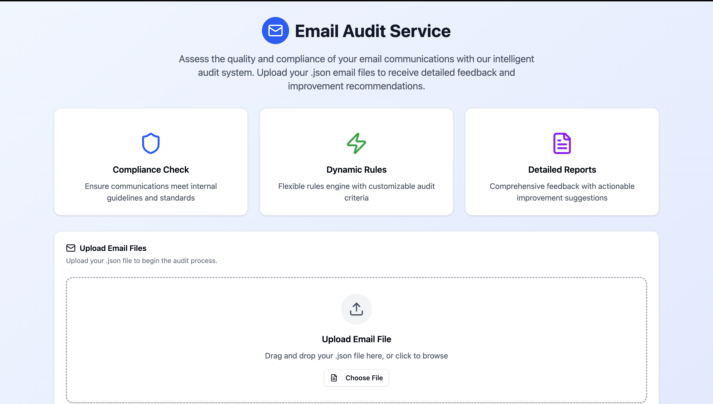
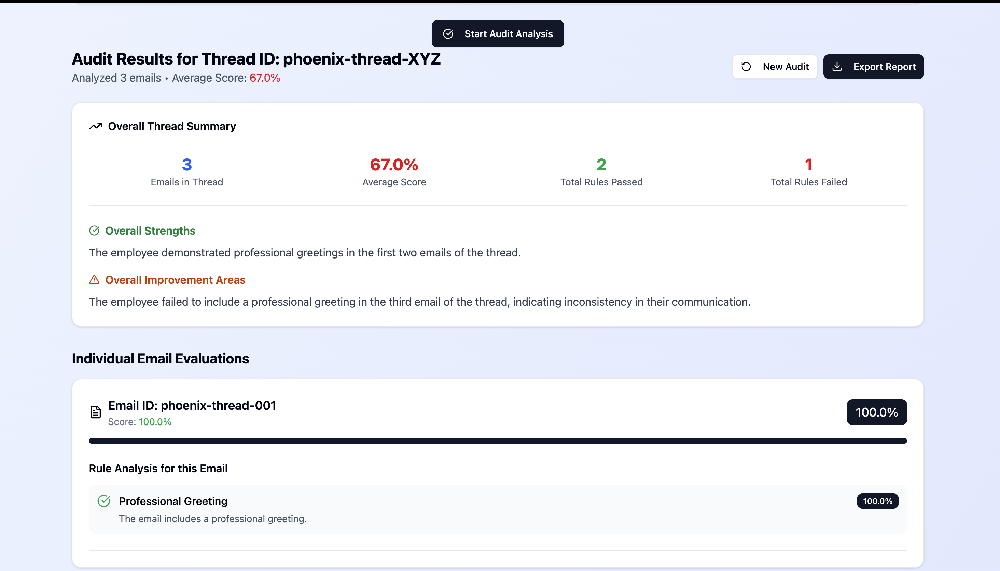

# Email Auditor
A full-stack application designed to audit email content and threads, providing insights into professionalism, clarity, and adherence to communication best practices. The backend provides a robust API for email analysis using AI and rule-based logic, while the frontend offers an intuitive dashboard for users to upload email data (as JSON) and view detailed audit reports.

-----
<p align="center">
  
  <br>
  <em>A preview of the Email Auditor dashboard in action.</em>
</p>

<p align="center">
  
  <br>
  <em>A preview of the Email Auditor analysis in action.</em>
</p>

## Features

**Backend API:**

  * **Email Content Analysis:** Evaluates individual emails based on defined rules (e.g., professional greeting, formality, clarity, grammar).
  * **Thread-level Audit:** Analyzes entire email conversations to identify overarching patterns and provide comprehensive feedback.
  * **AI Integration:** Leverages AI services (e.g., Google's Gemini, or custom models) for advanced sentiment analysis, summarization, and tone detection.
  * **Rule Engine:** A flexible system to define and apply custom scoring rules for various communication aspects.
  * **Health Check Endpoint:** Simple endpoint to verify API operational status.

**Frontend Dashboard:**

  * **Intuitive File Upload:** Easy drag-and-drop or click-to-browse interface for uploading email data in `.json` format.
  * **Real-time Feedback:** Displays loading states, errors, and success messages during file processing and audit generation.
  * **Comprehensive Audit Reports:** Presents individual email scores, rule-by-rule breakdowns, overall thread strengths, improvement areas, and top suggestions.
  * **Export Functionality:** Allows users to download the generated audit report as a JSON file.
  * **Modern UI:** Built with React and Shadcn UI for a clean, responsive, and user-friendly experience.

-----

## Getting Started (Local Development)

Follow these steps to get the Email Auditor running on your local machine without using Docker.

### Prerequisites

Before you begin, ensure you have the following installed:

  * **Node.js** (v18 or higher recommended)
  * **npm** (Node Package Manager, usually comes with Node.js)
  * **Git** (for cloning the repository)

### Installation

1.  **Clone the repository:**

    ```bash
    git clone https://github.com/<your-username>/email-auditor.git # Replace with your repo URL
    cd email-auditor # Or whatever your root project folder is named
    ```

2.  **Install Backend Dependencies:**
    Navigate into the `backend` directory and install its dependencies.

    ```bash
    cd backend
    npm install
    ```

3.  **Install Frontend Dependencies:**
    Navigate into the `frontend` directory and install its dependencies.

    ```bash
    cd ../frontend # Go back to the root, then into frontend
    npm install
    ```

-----

## Running the Application

You will need to run both the backend API and the frontend dashboard separately. Please open **two separate terminal windows/tabs** for this.

### 1\. Run the Backend API

1.  **Navigate to the `backend` directory** in your first terminal:

    ```bash
    cd backend
    ```

2.  **Build the TypeScript code:**
    This command compiles your TypeScript source files into JavaScript files in the `dist/` directory.

    ```bash
    npm run build # This command typically runs 'tsc -b'
    ```

3.  **Start the backend server:**
    This command runs the compiled JavaScript code.

    ```bash
    npm start # This command typically runs 'node dist/index.js'
    ```

    The backend server should start on `http://localhost:3000`. You'll see a message like "Backend server running on [http://0.0.0.0:3000](https://www.google.com/search?q=http://0.0.0.0:3000)" or similar in your terminal.

      * **Health Check:** You can verify the backend is running by visiting `http://localhost:3000/api/health` in your browser. You should see a success message.

### 2\. Run the Frontend Dashboard

1.  **Navigate to the `frontend` directory** in your second terminal:

    ```bash
    cd frontend
    ```

2.  **Configure Frontend API URL (Crucial Step):**
    Your frontend needs to know where to find the backend API. Create a file named `.env.development` in your `frontend/` directory if it doesn't already exist. Add the following line:

    ```
    VITE_APP_API_BASE_URL=http://localhost:3000
    ```

      * **Note:** If your frontend project uses Create React App (CRA), the environment variable might be named `REACT_APP_API_BASE_URL`. If you have a proxy setup in your `vite.config.js` or `package.json`, ensure it points to `http://localhost:3000`.

3.  **Start the frontend development server:**

    ```bash
    npm run dev # Or 'npm start' if using Create React App
    ```

    The frontend application should open automatically in your browser, typically at `http://localhost:5173` (if using Vite) or `http://localhost:3000` (if using Create React App).

-----

## Usage

1.  **Access the Dashboard:** Open your web browser and go to the frontend URL (e.g., `http://localhost:5173`).
2.  **Upload JSON File:**
      * Drag and drop your JSON file containing email data onto the designated upload area, or click to browse.
      * The JSON file should conform to the `ThreadAuditRequest` structure expected by the backend.
3.  **Generate Report:** Click the "Generate Audit Report" button.
4.  **View Results:** The dashboard will display a comprehensive audit report including overall thread scores, individual email evaluations, rule-specific feedback, strengths, and areas for improvement.
5.  **New Audit / Export:** Use the buttons to clear the current report and start a new audit, or to export the current report as a JSON file.

-----

## Project Structure

```
email-auditor-project/
├── backend/                        # Node.js, Express, TypeScript API
│   ├── src/                        # Backend TypeScript source files
│   │   ├── app.ts                  # Main Express application entry point
│   │   ├── apiService.ts           # Handles external API calls (e.g., AI)
│   │   ├── models/                 # TypeScript interfaces/models for data (e.g., EvaluationResult.ts)
│   │   ├── ruleEngine.ts           # Core logic for email auditing rules
│   │   └── ...
│   ├── dist/                       # Compiled JavaScript output (generated by 'npm run build')
│   ├── node_modules/
│   ├── package.json
│   └── tsconfig.json
│
├── frontend/                       # React, TypeScript, Shadcn UI Dashboard
│   ├── public/                     # Static assets
│   ├── src/
│   │   ├── App.tsx                 # Main React application component
│   │   ├── components/             # Reusable React components (e.g., FileUpload, AuditResults)
│   │   ├── pages/                  # Pages/views (e.g., ThreadAuditPage)
│   │   ├── utils/                  # Utility functions
│   │   └── ...
│   ├── node_modules/
│   ├── .env.development            # Local environment variables for frontend API URL
│   ├── package.json
│   ├── tsconfig.json
│   └── vite.config.ts              # Frontend build configuration (or cra-specific configs)
│
├── .gitignore
└── README.md
```

-----

## API Endpoints

**Backend (http://localhost:3000)**

  * **`GET /api/health`**

      * **Description:** Checks the health and status of the API.
      * **Response:** `{"status":"ok","message":"Email Auditor API is running!"}`

  * **`POST /api/audit/email`**

      * **Description:** Audits a single email.
      * **Request Body (`application/json`):** `ParsedEmail` object.
      * **Response (`application/json`):** `EmailEvaluation` object.

  * **`POST /api/audit/thread`**

      * **Description:** Audits an entire email thread.
      * **Request Body (`application/json`):** `{ emails: ParsedEmail[], employeeEmail?: string }`
      * **Response (`application/json`):** `ThreadAuditReport` object.

-----

## Development

  * **Backend:** Changes to backend TypeScript files will require re-running `npm run build` followed by `npm start`, or you can use a development tool like `ts-node-dev` for hot-reloading (if configured in `package.json`'s `dev` script).
  * **Frontend:** The `npm run dev` (or `npm start`) command usually provides hot-reloading, so changes to your React files will automatically refresh the browser.

-----

## Contributing

Contributions are welcome\! Please follow these steps:

1.  Fork the repository.
2.  Create a new branch (`git checkout -b feature/your-feature-name`).
3.  Make your changes.
4.  Commit your changes (`git commit -m 'feat: Add new feature'`).
5.  Push to the branch (`git push origin feature/your-feature-name`).
6.  Open a Pull Request.

-----

## License

This project is licensed under the [MIT License](LICENSE.md) - see the `LICENSE.md` file for details.

-----

## Contact

For any questions or feedback, please open an issue in the repository.

-----
